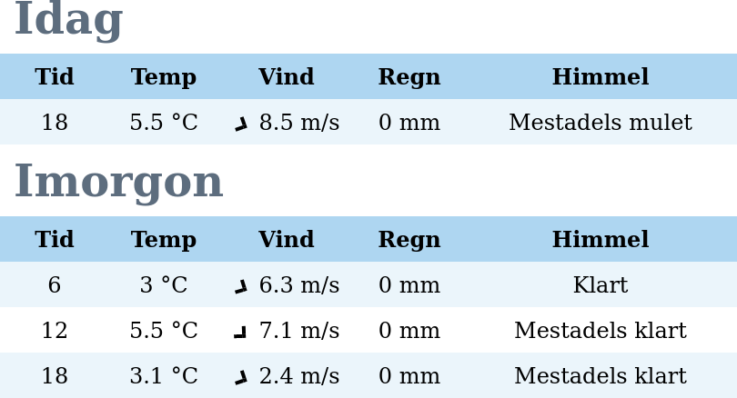

# weather.js

`weather.js` is a widget for displaying weather forecasts for today and tommorrow, fetched from SMHI's API.



## Usage

See `dist/index.html` for an example. The gist of it is:

1. Link to the stylesheet `dist/static/css/weather.css` in your html page.
2. Link to the script `dist/static/js/weather.js` in your html page.
3. Create the following div where you want the widget:
```html
<div id="weather_widget" lat="57.4356" lon="18.74653"</div>
```
(Change `lat` and `lon` to the coordinates of the location you want the weather forecast for.)

## Building
1. `npm install`
2. `npm run build`

## Starting the dev server
`npm run start`
